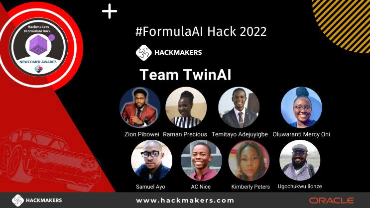

# Oracle FormulaAI Hack Global Competition 2022 - Team TwinAI Solution
This repo contains our winning solution to Challenge 1 of the **Oracle FormulaAI Hack 2022**. Our team emerged as one of the 9 prize-winning teams and won the Newcomer Team award.

## Challenge 1 Background

Formula 1 is one of the most competitive sports in the world. Engineers and technicians from every team use weather radar screens, provided by Ubimet to the teams, which allows them to track the current weather and make predictions during the race. Race engineers relay precise information to drivers, including:
- How many minutes until it starts raining
- Intensity of the rain
- Which corner will be hit first by the rain
- Duration of the rain

Points, and even races sometimes, are won and lost based on making sense of what the weather is going to do during a race, and being prepared as a team to act accordingly.

Therefore, weather forecasting takes a big part on the possible outcome of a race. Similarly, F1 2021, the official Formula 1 videogame developed by Codemasters, uses a physics engine that behaves like the real world.

## Objective
The objective of Challenge 1 was to build an accurate weather forecasting model for the F1 2021 videogame using historical weather data from the RedBull Racing eSports team. See full details of the problem specification on the [official challenge repo](https://github.com/oracle-devrel/formula-ai-2022-hackathon/blob/main/challenges/challenge1.md).

## Our Team
Our team, Team TwinAI, consisted of 8 members and was further divided into 3 subteams for efficient workflow management. Here's the team distribution:
#### Analysis & Machine Learning 
- [Zion Pibowei](https://github.com/zion-king)
- [AC Nice](https://github.com/anochima)
- [Temitayo Adejuyigbe](https://github.com/Tbenseu)
#### Engineering
- [Ayo Samuel](https://github.com/Stosan)
- [Ugochukwu Ilonze](https://github.com/harryface)
#### Product & Research
- Mercy Oni
- Precious Raman
- Kimberly Peters

## Our Winning Solution
Our solution, [Learning to Hack F1 2021 Weather Conditions](https://github.com/zion-king/twin-ai-formula-ai-hack/blob/main/final-solution-notebooks/twin-ai-full-notebook-solution.ipynb), consists of an end-to-end machine learning workflow for creating a high-performing model to forecast the weather conditions of a F1 2021 game session. Our model is able to accurately predict the weather type 5, 10, 15, 30 and 60 minutes after a timestamp, and the corresponding rain percentage probability at each time. See the video pitch of our solution [here](https://youtu.be/W8kyFGJE7d4).

## Prize Announcement
We won the Newcomer Team awards, worth $5,000, and were proud to represent Africa among the 9 prize winners. See official prize announcement on [Linkedin](https://www.linkedin.com/posts/hackmakers_formulaai-worldinnovationday-hackathon-activity-6914783292424601600-t2W1?utm_source=linkedin_share&utm_medium=android_app) and [Youtube](https://youtu.be/vTCfR9eB_mo).

